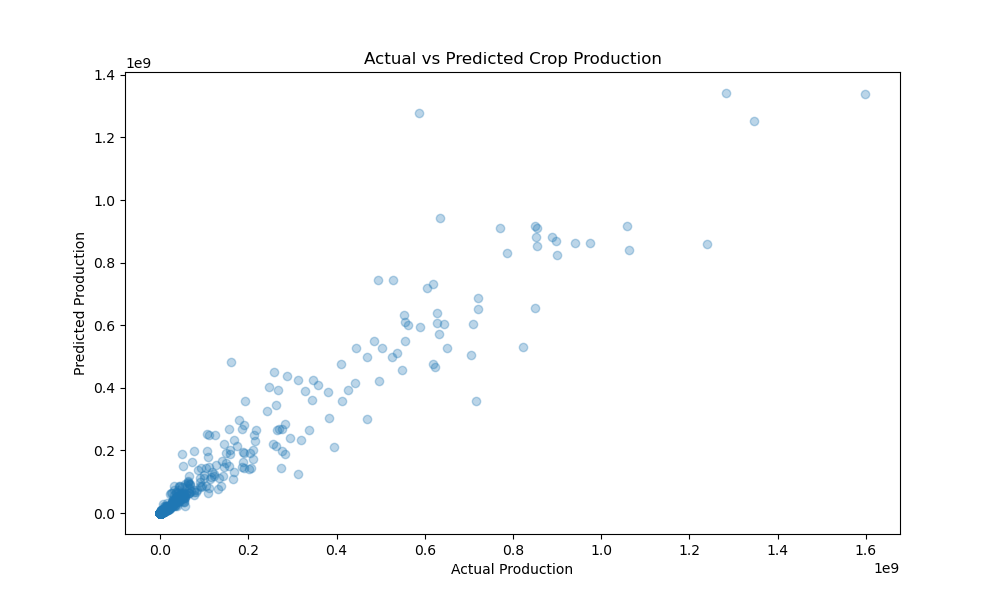
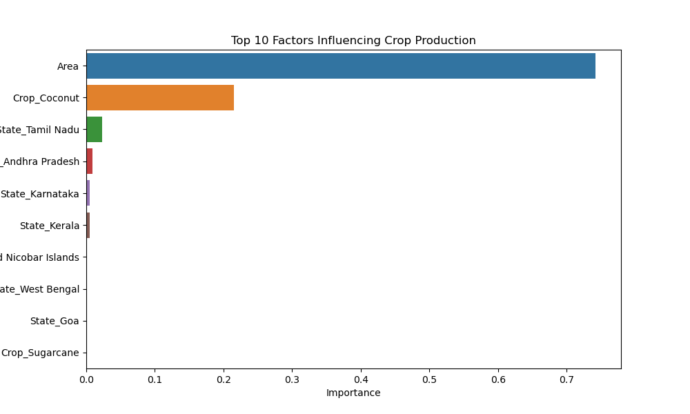

# Crop-Yield-Prediction-India
Machine Learning project to predict crop yield based on state, season, and area using Indian Agriculture datasets.

 # 🌾 India Crop Yield Prediction Analysis

## 📊 Performance Metrics
- **R2 Score:** 0.939 (94% Accuracy)
- **Mean Absolute Error:** 214,112 units
- **Model Used:** Random Forest Regressor

## 💡 Key Findings
- **Area is the #1 predictor:** As expected, the size of the land has the highest impact on total production.
- **Regional Variations:** Certain states (like Punjab and UP) show significantly higher production efficiency for specific seasons.

## 🛠️ Tech Stack
- **Python** (Pandas, Scikit-Learn)
- **Data Source:** India Agriculture Crop Production Dataset (2024 updated)
- **Preprocessing:** OneHotEncoding for Categorical variables, Handling of Null values.

## 📈 Visualizations

